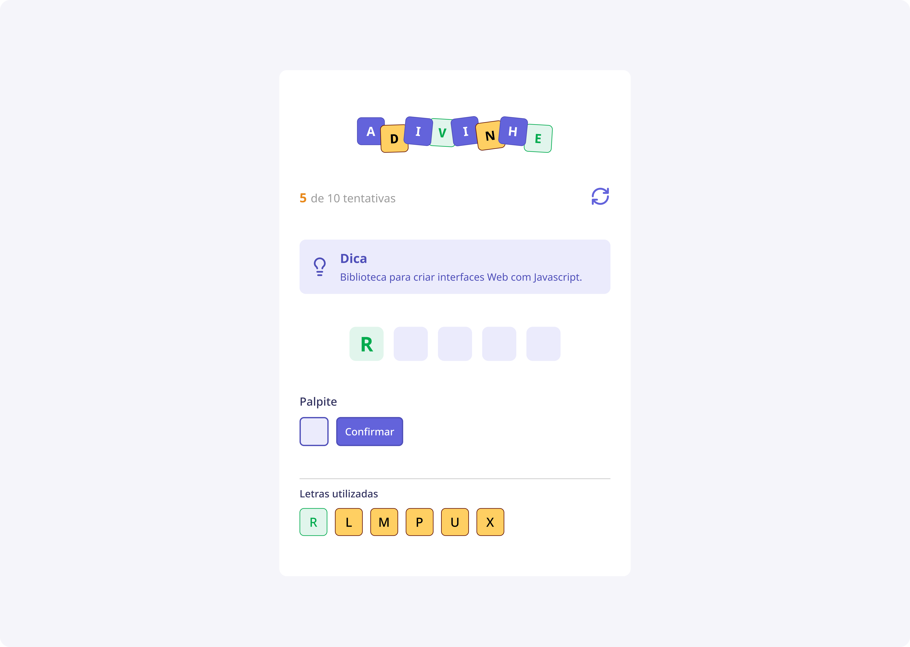

#  Adivinhe

Coloque suas habilidades de dedução à prova com **Adivinhe**, um jogo interativo desenvolvido em React. Enfrente o desafio de descobrir palavras ocultas a partir de dicas fornecidas, dentro de um limite de tentativas, enquanto se diverte com uma interface intuitiva e dinâmica. 🔮



## 🛠️ Tecnologias Utilizadas

- ⚛️ **React**: Biblioteca para construção da interface do usuário.
- 🟦 **TypeScript**: Superset do JavaScript, trazendo tipagem estática e maior segurança ao código.
- ⚡ **Vite**: Ferramenta para desenvolvimento e build rápido de aplicações web.
- 🎨 **CSS**: Estilização personalizada e responsiva.

## ⚙️ Funcionalidades

- 🎲 Uma palavra aleatória é selecionada de um banco de palavras, juntamente com sua dica.
- 🕹️ O jogador tem um limite de tentativas para adivinhar a palavra.
- 📝 As letras já utilizadas aparecem em uma seção dedicada, facilitando o acompanhamento.
- 🔀 Palavras aleatórias garantem variedade e desafio constante.
- 💡 Estilização agradável e interface responsiva para uma melhor experiência de jogo.

## ✅ Pré-requisitos

Antes de começar, certifique-se de ter instalado em sua máquina:

- ✅ **Node.js** (v16 ou superior)
- ✅ **npm** ou **yarn**

## 🚀 Como Rodar o Projeto

1. Clone este repositório:

   ```bash
   git clone https://github.com/joschonarth/adivinhe.git
   ```

2. Acesse o diretório do projeto:

   ```bash
   cd adivinhe
   ```

3. Instale as dependências:

   ```bash
   npm install
   # ou
   yarn install
   ```

4. Inicie o servidor de desenvolvimento:

   ```bash
   npm run dev
   # ou
   yarn dev
   ```

5. Acesse o jogo no navegador:

   ```bash
   http://localhost:5173
   ```

## 🌐 Teste o Jogo

O deploy do projeto foi realizado na Vercel! Você pode jogar diretamente acessando o link abaixo:

👉 [**Adivinhe na Vercel**](https://adivinhe-eight.vercel.app/)

---

🎮 Espero que você se divirta jogando **Adivinhe**! 🎮
